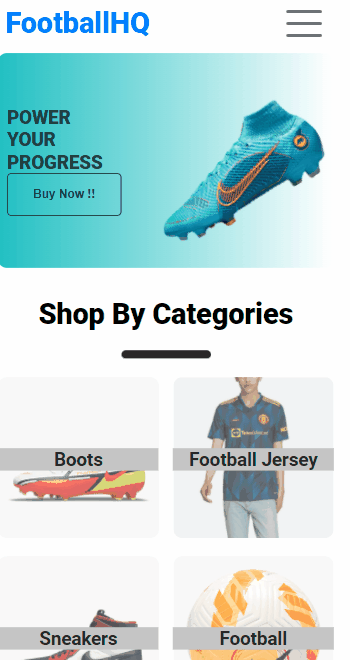

# eCommerce-screens

This repo contains the CSS for the screens of my eCommerce App

### shoeCommerce is an online eCommerce that sells shoe for football fanatics.

# Table of Contents

- [Card](https://ecommerece-shoe-screen.netlify.app/pages/card/card.html)
- [Cart](https://ecommerece-shoe-screen.netlify.app/pages/cart/cart.html)
- [Home](https://ecommerece-shoe-screen.netlify.app/pages/home/home.html)
- [Login](https://ecommerece-shoe-screen.netlify.app/pages/login/login.html)
- [Product](https://ecommerece-shoe-screen.netlify.app/pages/product/product.html)
- [SignUp](https://ecommerece-shoe-screen.netlify.app/pages/signup/signup.html)
- [Wishlist](https://ecommerece-shoe-screen.netlify.app/pages/wishlist/wishlist.html)
- [Single Product Page](https://ecommerece-shoe-screen.netlify.app/pages/singleproduct/singleproduct)
- [Profile](https://ecommerece-shoe-screen.netlify.app/pages/profile/profile.html)

# Quick Start

## Clone the repository

- Using git bash : `git clone https://github.com/Kevin-Solomon/eCommerce-screens.git`

# Issue Reporting

Encountered a bug or do you need a need a feature request ? Please to do check the issues tab on the repo if your issue / request does not exist , [open a new issue](https://github.com/Kevin-Solomon/eCommerce-screens/issues/new)

**_If you have encountered a bug a before and after picture of the bug would be very helpful or if time permits a small video of the bug would greatly help us undertand the issue._**

# 👨‍💻 Connect with me

# Desktop Version

# Mobile Version

